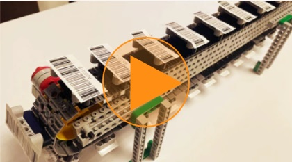
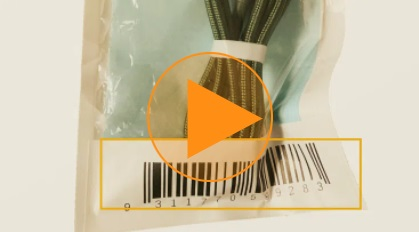
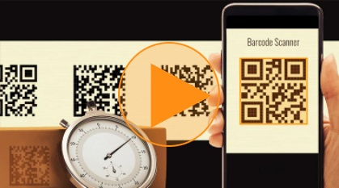

# Introduction to Dynamsoft Barcode Reader

Dynamsoft Barcode Reader (DBR) enables you to embed barcode reading capabilities with enterprise-class performance in your web, mobile, desktop or server applications using just a few lines of code.

## Features

### High performance

DBR is carefully designed to provide a good balance of performance between speed, read rate and accuracy when reading barcodes.

### Multi-code recognition

DBR can read multiple barcodes of different barcode formats at once.

### Powerful customizability

DBR offers hundreds of custom settings that allow fine-tuning of the entire recognition process to achieve optimal performance for specific usage scenarios.

## Supported Barcode Formats

As of version 9.0, DBR supports the following barcode formats:  

| 1D/Linear Barcodes       | 2D Barcodes         | GS1 DataBar             | Postal Codes          | Other Types        |
|--------------------------|---------------------|-------------------------| --------------------- | ------------------ |
| Code 39/Code 39 Extended | QR Code             | Omnidirectional         | USPS Intelligent Mail | GS1 Composite Code |
| Code 93                  | Micro QR Code       | Truncated               | Postnet               | Patch Code         |
| Code 128                 | Data Matrix         | Stacked                 | Planet                | Pharmacode         |
| Codabar                  | PDF417              | Stacked Omnidirectional | Australian Post       |                    |
| Interleaved 2 of 5       | Micro PDF417        | Limited                 | UK Royal Mail         |                    |
| EAN-8                    | Aztec Code          | Expanded                |                       |                    |
| EAN-13                   | MaxiCode (mode 2-5) | Expanded Stacked        |                       |                    |
| UPC-A                    | DotCode             |                         |                       |                    |
| UPC-E                    |                     |                         |                       |                    |
| Industrial 2 of 5        |                     |                         |                       |                    |
| MSI (Modified Plessey)   |                     |                         |                       |                    |
| Code 11                  |                     |                         |                       |                    |

## Supported Platforms

| Platforms | Languages                 |
|-----------|---------------------------|
|  Web       | JavaScript                |
| iOS       | Swift, Objective-C        |
| Android   | Java, Kotlin              |
| Windows   | C, C++, C\#, Python, Java |
| Linux     | C, C++, Python, Java      |
| macOS     | C, C++, Python, Java      |

Choose the programming language you use to build your application and learn more about adding barcode reading capabilities with DBR:

* [JavaScript (Web)]({{site.js}})
* [Java (Android)]({{site.android}})
* [Object-C or Swift (iOS)]({{site.oc}})
* [Python (Windows, Linux, macOS)]({{site.python}})
* [Java (Windows, Linux, macOS)]({{site.java}})
* [C\# (Windows)]({{site.dotnet}})
* [C++ (Windows, Linux, macOS)]({{site.cpp}})
* [C (Windows, Linux, macOS)]({{site.c}})
